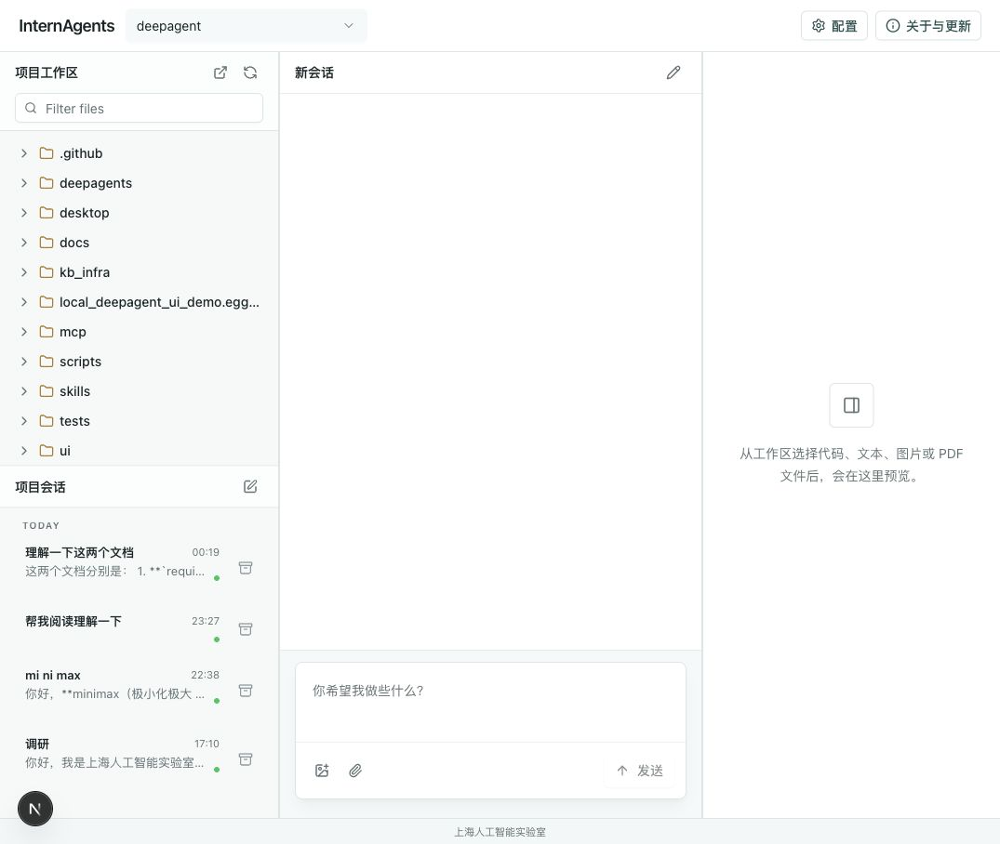

# InternAgents

[中文](README.md) | [English](README.en.md)

InternAgents 是由上海人工智能实验室研发的智能体工作台，面向科研、学习和技术探索场景，帮助用户围绕工作区文件完成阅读、总结、分析、生成和审批协作。

## 用户手册网站

我们提供了独立的中文用户手册网站：

[打开 InternAgents 用户手册](https://internscience.github.io/InternAgents/)

网站会介绍工作台、任务教程、文件预览、会话管理、附件、配置、技能、审批和常见问题。

如果 GitHub Pages 正在生效中，也可以先查看 Markdown 版本：

[Markdown 手册](用户手册/user-manual.md)

