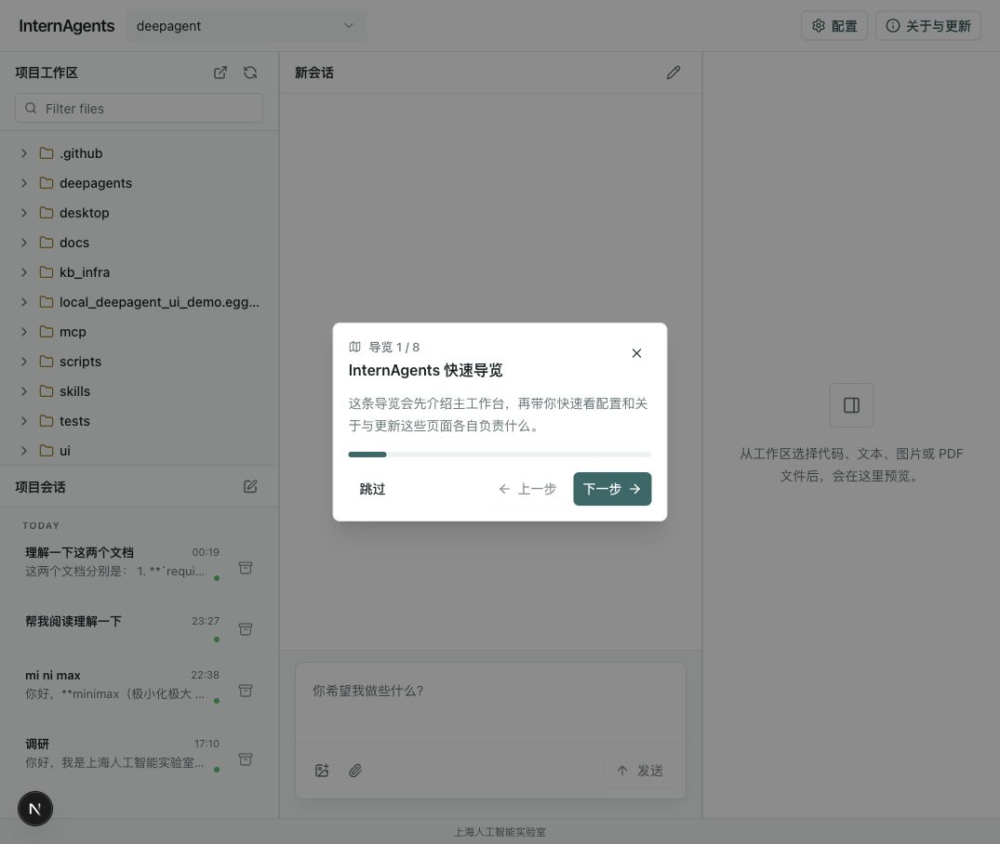

# InternAgents

[中文](README.md) | [English](README.en.md)

InternAgents 是由上海人工智能实验室研发的智能体工作台，面向科研、学习和技术探索场景。它不是一个单纯用于闲聊的大模型入口，而是把对话、文件、项目资料、工具能力和用户审批组织在同一个工作台中，让 AI 能够进入真实任务流程，协助理解材料、拆解问题、整理结论和推进工作。

## 项目定位

InternAgents 希望成为研究者、学生和知识工作者身边的 AI 工作伙伴。用户可以把论文、笔记、实验记录、项目文档或其他资料放入工作区，然后用自然语言向 InternAgents 提问或交代任务。InternAgents 会围绕当前工作区进行阅读、分析、总结和生成，并在关键操作前保留人的监督与确认。

它适合处理这些任务：

- 阅读论文、PDF、Markdown、文本资料和实验记录。
- 总结材料，提炼研究问题、方法、贡献、局限和后续方向。
- 对比多份文档，整理方案差异、优缺点和适用场景。
- 理解项目资料，帮助快速掌握材料结构、主题脉络和关键信息。
- 生成报告、综述大纲、待办清单、实验分析和修改建议。
- 将较长目标拆成多个步骤，在同一会话中持续推进。

## 核心概念

InternAgents 的使用围绕两个概念展开：

- 工作区：InternAgents 能看到和处理的本地文件夹。用户把本次任务相关的资料放进工作区，InternAgents 就可以围绕这些资料展开工作。
- 会话：用户和 InternAgents 围绕一个问题形成的一段对话记录。不同任务可以放在不同会话里，便于回看、继续和归档。

## 工作台体验

InternAgents 的主界面采用三栏工作台：

- 左侧是项目工作区和会话列表，方便浏览文件、切换任务和管理历史对话。
- 中间是聊天区，用户可以直接输入任务、追加说明、附加图片或文件。
- 右侧是文件预览区，可以查看 Markdown、文本、PDF 和常见图片。

打开工作台后，InternAgents 可以通过快速导览介绍工作台、工作区、会话、配置和更新入口，帮助用户尽快理解整体流程。

## 主要能力

### 文献与资料阅读

InternAgents 可以帮助阅读论文、PDF、项目说明和研究笔记，输出结构化总结，例如研究问题、核心方法、实验结果、贡献、局限和可继续探索的方向。

### 多文档比较

当工作区中有多份方案、论文摘要或实验说明时，InternAgents 可以进行横向比较，整理成表格或清单，帮助用户快速判断差异和取舍。

### 项目资料理解

面对一组陌生资料，InternAgents 可以先梳理目录、说明文档和关键文件，帮助用户了解项目目标、材料结构、重要内容和阅读顺序。

### 报告与内容生成

在完成阅读或分析后，InternAgents 可以继续协助生成 Markdown 报告、综述大纲、实验分析、会议准备材料、待办清单或其他结构化文档。

### 技能扩展

InternAgents 支持通过技能增强特定任务能力，例如论文阅读、实验分析、资料整理、项目规范和文档写作。用户可以根据当前任务选择合适技能，让智能体更贴近具体场景。

### 远程工作区

通过工作区选择-添加远程工作区可以基于本地的ssh config连接到远程服务器。InternAgent会检查连接并自动同步本地配置，配置完成后可以直接通过InternAgent在远程服务器上操作，使用远程计算/数据资源。

## 人在回路

InternAgents 强调用户对关键操作的监督。涉及文件写入、内容修改或其他高影响操作时，可以通过授权模式要求确认。用户可以查看操作目的、目标位置和风险，再决定批准、拒绝或修改参数。

这种设计让 InternAgents 既能参与较复杂的任务，也能保留人的判断、审批和纠偏空间。

## 适用人群

InternAgents 适合这些用户：

- 需要快速阅读和整理论文的科研人员。
- 正在做课程项目、实验报告或文献调研的学生。
- 需要理解项目资料或技术文档的知识工作者。
- 希望把 AI 用在真实工作区中，而不只是进行单轮问答的用户。

## 用户手册

本仓库包含完整的中文用户手册：

- [用户手册网站](https://shuyuehu.github.io/InternAgents/user-manual/)
- [Markdown 手册](用户手册/user-manual.md)

用户手册会介绍工作台、文件预览、会话管理、附件、配置、技能、审批和常见问题。
